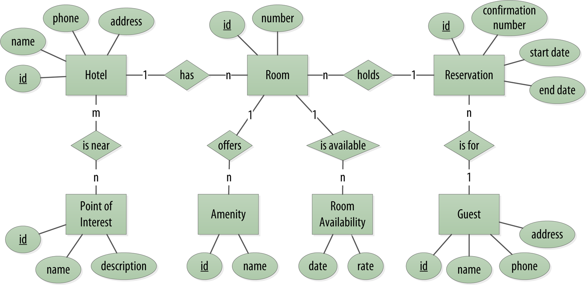

# Get to know `cqlsh`

In this scenario, we'll get to know Cassandra's command line shell `cqlsh`.

We've already installed Cassandra on this instance for you and started a running instance, now all that remains is to start the shell, and you'll be ready to learn some basic commands:

`./apache-cassandra-4.0-alpha3/bin/cqlsh`{{execute}}

